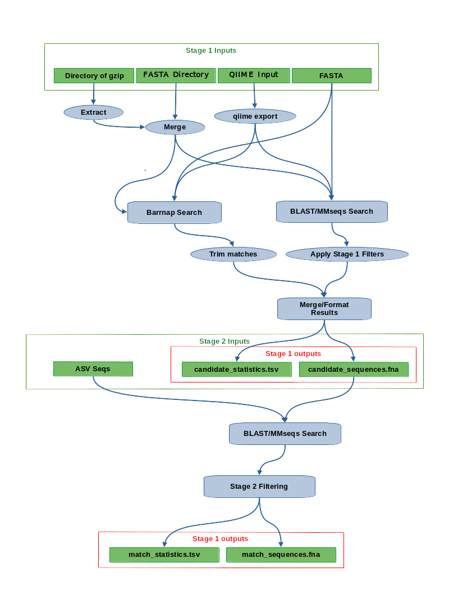

# Comparing 16S (ASV) to Bins

This tool provides a method for connecting 16S rRNA sequences to a set of bin-scaffolds.
The code is in essence a wrapper around a Snakemake pipeline that uses barnap and MMseqs2, with the option of substituting BLAST for MMseqs2.
This is not a perfect system, and is also a work in progress.

## Install

The tool can run on as few as 1 core but it will utilize as many cores as specified by the -t argument.  MMseqs2 is much faster than BLAST but will require more memory, often in the range of 40 - 60 gigabytes depending on the size of the target data set. Using blast will decrease the memory requirements but will also require a long run time.

## Install

The installation should be no more complex than:

```
wget https://raw.githubusercontent.com/rmFlynn/16S_to_bins_project/main/environment.yaml
conda env create -f environment.yaml -n join_asvbins
conda activate join_asvbins
```

Creating a conda enviroment is the best way to run tool becouse it depends not only on several python librarys but also on severaly comandline tools.
If you wish to, or a forced by circumstance, to install this tool outside of conda you should have all the information you need in the enviroment.yaml file to do so.

## Output

The program makes and removes many temporary files while running, but when the program finishes running only 4 files should remain in the output directory. The output files are:

1. candidate_statistics.tsv
2. candidate_sequences.fna
3. match_statistics.tsv
4. match_sequences.fna

The candidate files concern sequences that are candidates to be asvs. A sequence is a candidate if BLAST/MMseqs matches it to a sequence in the generic 16S data set, or it is identified as a potential 16S by Barrnap, and it meets our own selection criteria. The sequences themselves are in  candidate_sequences.fna, and the numbers that describe those sequences are in candidate_statistics.tsv.
The match files concern sequences previously found to be candidates, and where matched to the ASV sequences by BLAST/MMseqs. The sequences themselves are in  match_sequences.fna, and the numbers that describe those sequences are in match_statistics.tsv.


## Use Example
```
join_asvbins \
        -b path/to/bins/folder/or/file.fa \
        -a /path/to/asv/file.fa \
        -o /path/to/output \
        -t 20 # Threads
```

The most important command line options are:

```
  -b BINS, --bins BINS  The bin that you would like to match asvs to. This can be an fna file that has all the bins
                        combined or a directory of bins in separate fa files, but you must run the rename script
                        before you use this tool

  -a ASV_SEQS, --asv_seqs ASV_SEQS
                        The asvs you would like to attach to your bins.

  --bin_16S_seqs BIN_16S_SEQS
                        Provide a fasta file of 16S sequences to serve as input to the second search in the sequence, the search matching bins against asv's. If this argument is provided then the bins argument will be ignored and the stage on fast and stats.tab not be made. Note
                        that your sequences must be trimmed, before you run this program. (default: None)

  -o OUTPUT_DIR, --output_dir OUTPUT_DIR
                        The folder where you would like the temporary files and the final output to be stored

  -t THREADS, --threads THREADS
                        The number of threads that will be used by the program and subprocess.

  --no_clean            Specifies that the directory should NOT be cleaned of results of pass runs. If your run is
                        interrupted this will allow you to to pick up. where you left off. Use at your own risk.
   -g GENERIC_16S, --generic_16S GENERIC_16S
                        A set of generic_16S files that may be part of your bins. (default: None)
  --blast               Specifies that blast should be used instead of mmseqs. Good if you have limited memory or don't trust MMseqs2. (default: False)
```
But there are many more, use `join_asvbins -h` to see all of them.

To get the full benefits of the program, it is expected that a user will run the program having specified at least `--bins`, `--asv_seqs`, `--output_dir` and `--generic_16S`, or more simply `-b`, `-a`, `-o` and `-g`, with appropriate values as described above. Running with these arguments and without the --candidates argument will result in a full run, a full run is the name we use to describe a run that produces all the main output data sets, that is to say  the candidate and match data sets.

If the asv_seqs argument is not provided, then only the data for candidate ASVs will be produced. If the --candidates argument is provided, then the --bins argument will be ignored and only data for matches to the file specified by --candidates will be produced. In the documentation, we refer to two of these options as a partial run.

The `--generic_16S` option is currently required, but there are plans to make this optional. This argument must point to a FASTA file that can be used to find candidate 16S sequences. It should therefore be a large collection of diverse 16S sequences, for example we use a clustered version of the SILVA database. Once we move our database to an accessible location, we will give the user the option of admitting this argument and downloading our DB to use instead.

A longer exploration of options will also be added to the wiki soon, and some of the more important advanced options are in this document, in a section by the same name. If it is not clear to you how to use these arguments, please look at the example section below.

## How it works

Most of the program is hidden from the user and it is hoped that they will never need to know the fine details of the process, but if something happens to go wrong then this may help explain why .

/*:Under the hood join_asv_bins activates a [Snakemake](https://snakemake.readthedocs.io/en/stable/) pipeline, which orders tasks based on the inputs that are required, and the outputs that are expected. The order of tasks takes the form of a Directed Acyclic graph (DAG) an example of which is shown below. In the example below each task is listed in order from first to run at the top to last to run at the bottom.  For example the last task to run is named all, and its job is only to ensure all the final output files are created. It is also important to know that your DAG may not look like this one. This DAG depends on the options being present for a full run, producing candidate, and match sequences and statistics. If you do a partial run option your DAG will contain only a fraction of these steps.
*/
Below you can see a visualization of the entire matching pipeline complete with major inputs and outputs. This figure can give an approximate idea of how the pipeline works in a full or partial run, but it is an abstraction, not a literal example of the programmed pipeline.




## Advanced Options


Knowing about the Snakemake underpinning will allow you to make use of more advanced options.
The most popular of which is the option to continue in the case that a step failed using the `--no-clean` option. Yes, if your run fails halfway through the process, you can make a fix and continue where you left off. This is popular because running on a large data set takes a long time and a mistake could cut the program short, or the program could be killed by an external process.

This option can give hours back to the user, but it is **ADVANCED**. It is not guaranteed that the program will shut down elegantly, so you may have incomplete files that will corrupt your results, and this is only one of the things that can go wrong. Only use this option if you are confident in what you are doing.


## To do
-  [ ] Split mmseqs into multi steps
-  [ ] Rework the pandas code so that there is no warning
-  [ ] Stop the fai warnings from barrnap, make new rules if you must.
-  [ ] More general tests
-  [ ] Add a test to run full snake pipelines. (I am close on this)
*  [x] Add a better file path does not exist message, snakemakes does not handle this well with this setup.
*  [x] Check that verbose works as well as quiet dose
-  [ ] Compare my results to more manual equivalents
-  [ ] Complete the outputs section of this readme
-  [ ] Add an expanded options section to the wiki
-  [ ] Move the DAG section to the wiki and replace it with a outline of the process with outputs
-  [ ] Add a slum example below
-  [ ] Make that temp file go away
- [ ] faidx is too loud in verbose mode
- [ ] Add qiime to the environment.yml


# Current Testers in the Wrighton Lab
Please use the `-g` AKA `--generic_16S` argument to run the program, pulling data from git LFS is currently problematic in python. This will be fixed in the future but for now you can contact me and I will provide a clustered SILVA dataset for reproducibility.

## Slurm

You may want to know what a slurm job for this program would look like.

```
#!/bin/bash
#SBATCH --nodes=1
#SBATCH --ntasks=<threads>
#SBATCH --mem=40gb
#SBATCH --time=240:00:00
#SBATCH --job-name=<any name>
#SBATCH --mail-type=BEGIN,END,FAIL
#SBATCH --mail-user=<your email>
#SBATCH --partition=<your partition>
#SBATCH --output=<any name>_%j.out

eval "$(conda shell.bash hook)"
conda activate join_asvbins

cd <a directory to work from>

join_asvbins \
        -b <your bins folder or file> \
        -a <ASV FASTA file> \
        -o <The output directory> \
        -g <Path to a generic 16S fasta> \
```


